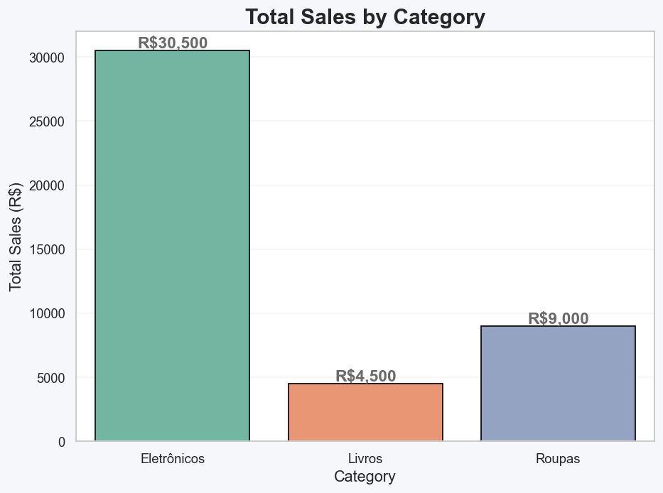
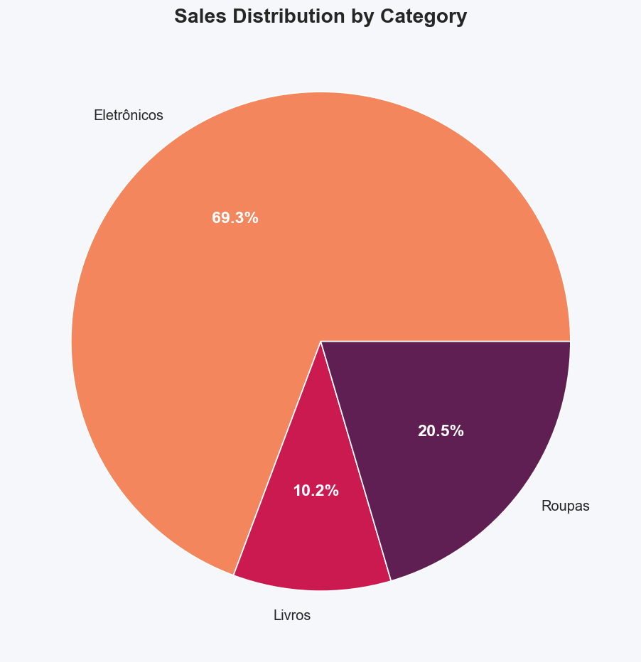
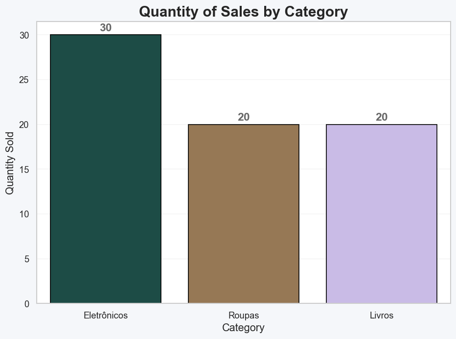
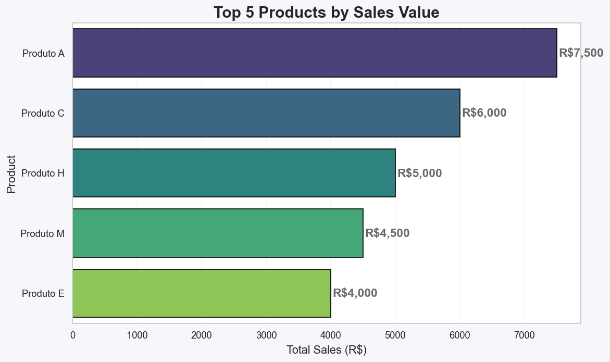
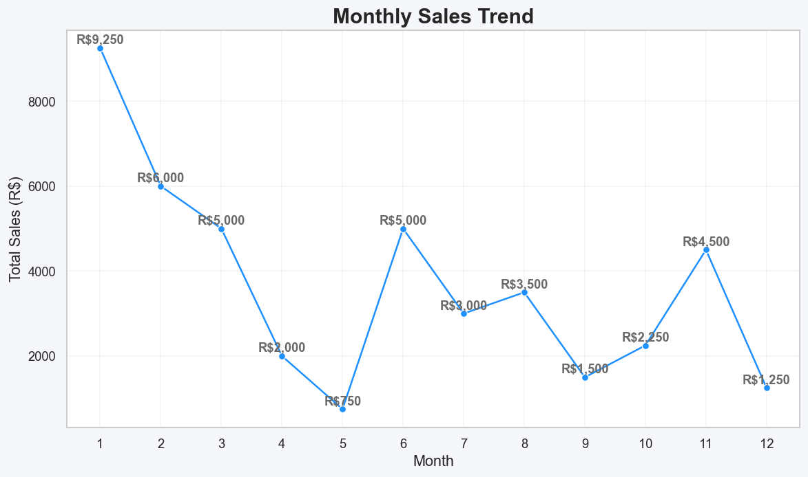
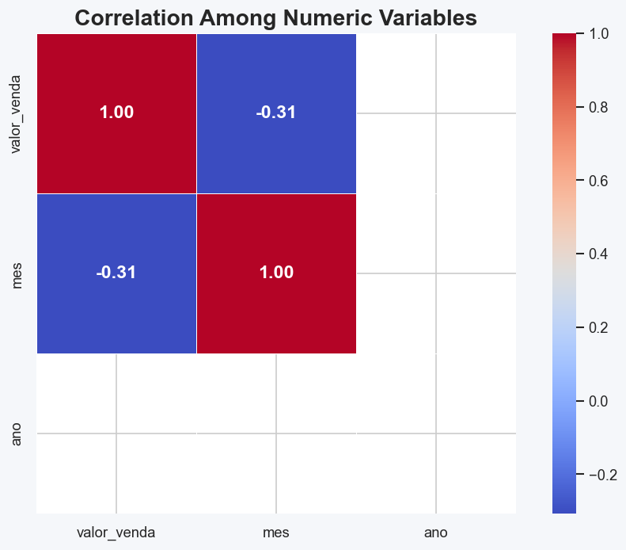

# 📊 Sales Analysis — Python, Pandas, SQLite & Data Visualization

Welcome! This project offers a modern pipeline for sales analytics using Python. From SQLite database creation to advanced Pandas analytics and Matplotlib/Seaborn visualization, it’s ideal for learning, portfolio, or technical demonstration.

---

## 🚀 Project Overview

Analyze, visualize, and uncover insights from sales data with a modern and effective Python toolchain:

- **Database**: Automatic SQLite setup and population
- **Exploration**: Clean data, handle dates, descriptive statistics
- **Analysis**: Sales by category, product, time period, and more
- **Visualization**: Professional bar/column charts, pie charts, time series, heatmaps

---

## 🗂️ Project Structure

```plaintext
assets/
    sales_barplot_example.png
    sales_heatmap_example.png
    sales_pie_example.png
    sales_quantity_barplot_example.png
    sales_trend_example.png
    top_5_products_example.png
.gitignore
dados_vendas.db
LICENSE
main.py
README.md
requirements.txt
```

---

## 📥 Installation & Usage

1. Clone this repository:
    ```bash
    git clone https://github.com/solozabal/anhanguera-ml-sales-analysis-python.git
    cd anhanguera-ml-sales-analysis-python
    ```

2. Set up your virtual environment:
    ```bash
    python -m venv venv
    source venv/bin/activate  # or .\venv\Scripts\activate on Windows
    ```

3. Install the required libraries:
    ```bash
    pip install -r requirements.txt
    ```

4. Run the main analysis script:
    ```bash
    python main.py
    ```

---

## 🖼️ Example Output

<p align="center">
  
  <br>
  <em>Figure: Total Sales by Category</em>
</p>

<p align="center">
  
  <br>
  <em>Figure: Sales Distribution by Category</em>
</p>

<p align="center">
  
  <br>
  <em>Figure: Quantity of Sales by Category</em>
</p>

<p align="center">
  
  <br>
  <em>Figure: Top 5 Products by Sales Value</em>
</p>

<p align="center">
  
  <br>
  <em>Figure: Monthly Sales Trend</em>
</p>

<p align="center">
  
  <br>
  <em>Figure: Correlation among Numeric Variables</em>
</p>

---

## ⚡ Usage Example

```python
# main.py (snippet)
import pandas as pd

# After loading your DataFrame `df`
monthly_sales = df.groupby(['ano', 'mes'])['valor_venda'].sum().reset_index()
print(monthly_sales.head())

# Custom plot: Top 5 products
top_products = df.groupby('produto')['valor_venda'].sum().sort_values(ascending=False).head(5)
top_products.plot(kind='bar', title='Top 5 Products by Sales')
```

---

## 🛠️ Customization Tips

- **Add more data:** Connect to your own data source (Excel, CSV, API, etc.) by changing the data import section.
- **Expand database schema:** Add new columns (e.g., region, sales rep), update queries and analyses accordingly.
- **DIY dashboards:** Integrate with [Streamlit](https://streamlit.io/) for quick interactive dashboards.
- **Automate reports:** Use Python’s schedule library or GitHub Actions to refresh analyses periodically.

---

## 🌟 Standout Portfolio Features

- End-to-end workflow: DB creation, ETL, EDA, and beautiful plots in a single script
- Easy-to-follow code: Great for sharing on your portfolio or technical blog
- Modular for scaling up: Add advanced ML or business logic as you grow

---

## 💡 License

This project is licensed under the MIT License.

---

<p align="center">
  <a href="https://www.linkedin.com/in/pedrosolozabal/">
    
  </a>
</p>
